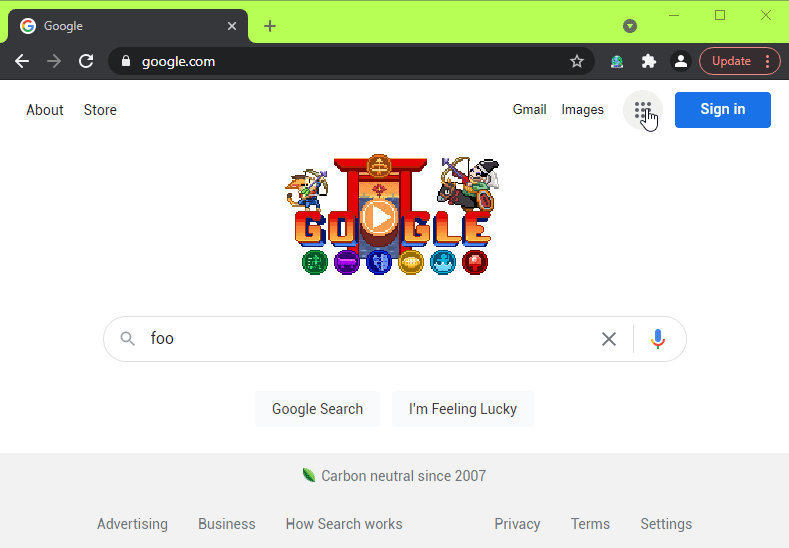

<h1 align="center">
  
   
   
  Global Click All
   
   
</h1>

<h3 align="center">
  A Chrome extension to automatically click every element matching the provided CSS selector, in every open tab.
</h3>

<h1 align="center">
  </a>
   
   
</h1>

Works in Brave also.